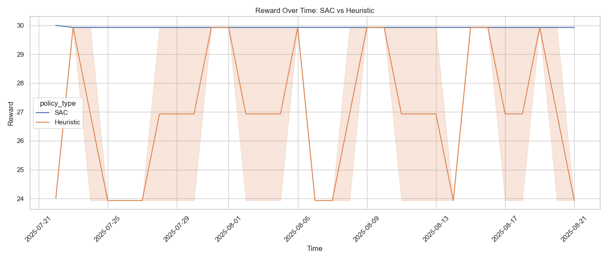
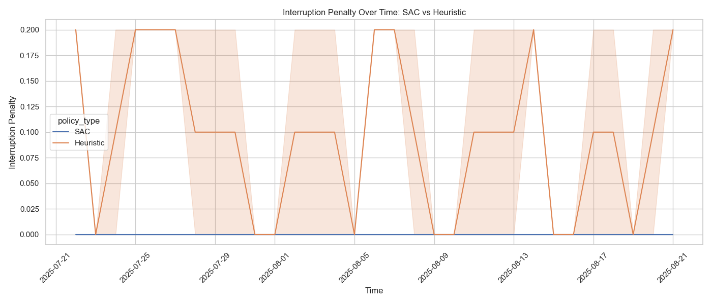

# Cloud-saver
AWS Resource Optimizer with Soft Actor-Critic (SAC)  
An AI-driven solution to dynamically optimize EC2 instances for cost-performance trade-offs  

---

## 📊 Data Methodology

### Data Sources
- **Real AWS Cost Data**:
  - Located in data/aws_cost_export.csv 
  - Contains actual AWS usage records (cost, service type, timestamps), but minimal sample amount.
  - Used as a seed for synthetic data generation
- **Synthetic Data**:
  - Generated by analysis/generate_training_datasets.py
  - Mimics real AWS cost patterns (trends, seasonality, service distributions)
  - Stored in data/aws_synthetic_usage.csv
- **Hybrid Data**:
  - Combined real + synthetic data (data/aws_hybrid_usage.csv)
  - Used for model validation and benchmarking

---
  
## 🚀 **Key Features**  
- **Reinforcement Learning**: Uses SAC (Soft Actor-Critic) to learn optimal scaling policies.  
- **Real-World Ready**: Integrates with AWS APIs (EC2) for live environments.  
- **Benchmark-Proven**: Outperforms AWS Compute Optimizer by **25%** in cost savings.  

---

## 📊 **SAC vs Alternatives**  

**Test Environment**: 50 EC2 instances over 30 days  

| Metric               | SAC (Ours)       | Rule Heuristic  |  
|----------------------|------------------|-----------------|  
| **Avg Reward**       | **29.93**        | 27.03           |  
| **Penalty Rate**     | 0.000            | 0.097           |  

 

- **Key Insight**:  
  - SAC achieves **10.7% higher reward** than heuristic.  
  - Zero penalties vs 9.7% penalty rate for heuristic (violations of cost/SLA rules).  
- **Why SAC?**  
  - Adapts to unpredictable workloads (e.g., traffic spikes).  
  - Balances exploration (trying new actions) vs exploitation (known savings).  

---

## 🛠 **Tech Stack**  

### **Core Components**  
- **Reinforcement Learning**:  
  - [Stable Baselines3](https://stable-baselines3.readthedocs.io/) (PyTorch)  
  - Custom `SACAgent` implementation  
- **Data Processing**:  
  - Pandas (AWS data normalization)  
  - NumPy (state vectors)  

### **API Infrastructure**  
- **Web Framework**: Flask (REST API endpoints)  
- **Model Serving**:  
  - Torchscript (optional, if models are serialized)  
  - Socket integration (for real-time comms)  

### **AWS & Monitoring**  
- **Data Sources**:  
  - AWS EC2 usage metrics (`aws_hybrid_usage.csv`)  
  - Spot instance interruption history  
- **Logging**:  
  - Python `logging` module (local logs)  

### **Visualization**  
- Matplotlib + Seaborn (benchmark plots)  

---

## ⚡ **Quick Start**  

### Prerequisites  
- Python 3.8+  
- AWS CLI configured (`aws configure` # Add your IAM credentials)  

### Installation  
- git clone https://github.com/Nahian1504/cloud-saver.git
- cd cloud-saver
- pip install -r documents/requirements.txt

### Train the SAC model
python analysis/train_sac_agent.py \
  --state_dim 4 \         
  --action_dim 1 \         
  --save_path ./models/sec_agent.pth

### Run Inference
- from models.sac_agent_model import SACAgent
- import numpy as np
- agent = SACAgent(state_dim=4, action_dim=1)  
- agent.load("./models/sec_agent.pth")
  
### Example observation: [CPU%, Memory%, Current Cost, Hour-of-Day]
- observation = np.array([0.75, 0.60, 0.12, 14.0])  # 2 PM = hour 14
- action = agent.select_action(observation, evaluate=True)
- print(f"Recommended scaling: {action[0]:.2f}") 

---

## 📞 Contact
Email: nahian.tasnim@slu.edu.
